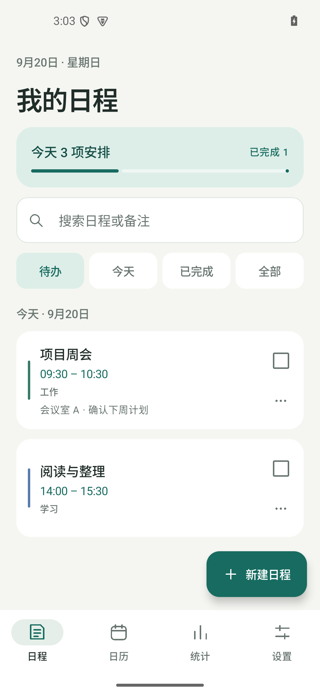
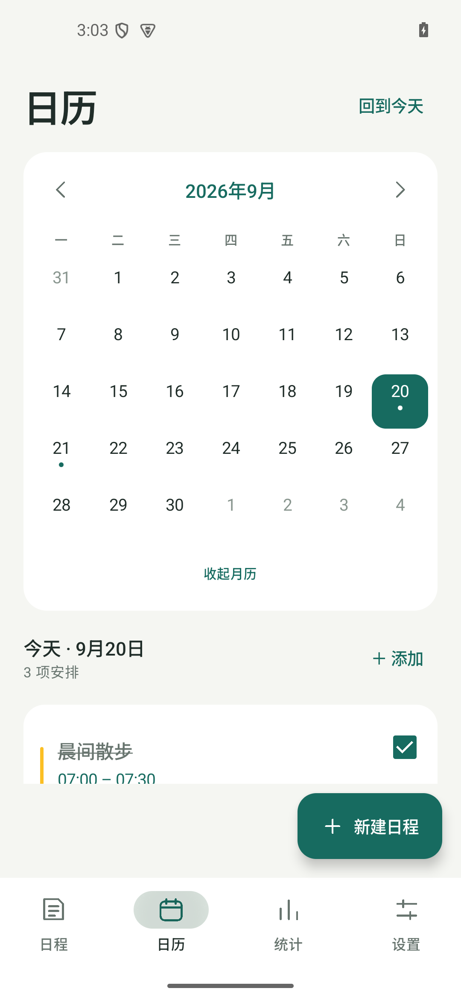
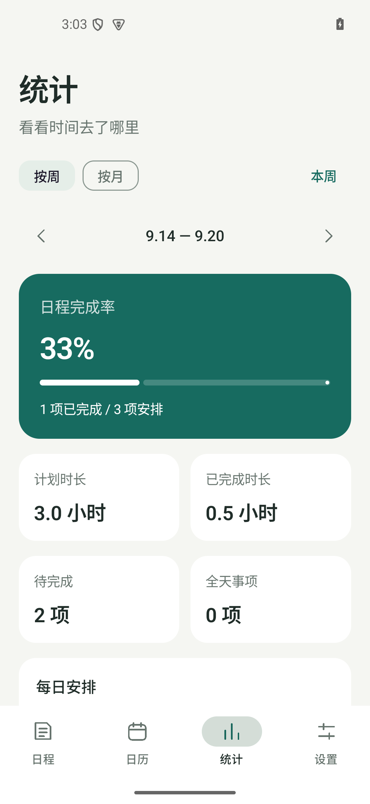

# TimeBlock · 时间段待办

[](https://github.com/wavachao/mockup/actions/workflows/ci.yml)
[](https://github.com/wavachao/mockup/releases/latest)

一款面向日常安排的 Android 日程应用。用具体时间段、全天事项或跨天日程记录计划，在列表与日历中管理安排，通过周/月统计了解计划分布。

**无需登录 · 本机保存 · 系统深浅色适配 · Android 8.0 及以上**

[下载安装](https://github.com/wavachao/mockup/releases/latest) · [版本记录](https://github.com/wavachao/mockup/releases) · [反馈问题](https://github.com/wavachao/mockup/issues)

## 功能

| 模块 | 能力 |
| --- | --- |
| 日程管理 | 新建、编辑、搜索、分类、备注、完成与撤销完成，保留过期未完成事项 |
| 时间安排 | 起止时间、全天事项、跨天安排，快捷日期与常用时间选择 |
| 日历视图 | 月历与周历切换，按日期查看、新建和调整日程 |
| 日程提醒 | 提前提醒，全天事项可在当天或前一天上午 9 点提醒 |
| 周/月统计 | 完成率、计划时长、每日安排及分类分布 |
| 外观与存储 | 自动跟随系统深浅色模式，使用本地数据库保存记录 |

统计中的时长表示**计划时长**，并非实际计时；全天事项不计入小时数，重叠日程分别累计。

## 界面预览

以下截图来自 1.2.0 的浅色界面；1.2.1 在此基础上增加系统主题跟随并修复提示停留问题。

<p align="center">
  
  
  
</p>

## 下载与使用

1. 打开 [GitHub Releases](https://github.com/wavachao/mockup/releases)，选择所需版本。
2. 在该版本的 **Assets** 中下载 `timeblock-v<版本号>.apk`，在 Android 设备上安装。
3. 点击「新建日程」，填写名称和日期时间；需要提醒时，允许应用发送通知。

当前源码版本为 **1.2.1**（`versionCode = 5`）。发布记录以 Releases 页面为准。

### 常见行为

- **默认开始时间**：当天日程按当前时间向上取到最近的 15 分钟，例如 10:38 → 10:45；其他日期默认 09:00。不会沿用上次的开始时间。
- **记住的选项**：新建日程会沿用上次保存的分类，以及具体时间日程的提醒选项。
- **操作提示**：「日程已保存」和完成后的「撤销」提示会自动消失，撤销提示保留更长时间供操作。
- **深色模式**：随系统设置自动切换，无需在应用内单独开启。
- **提醒权限**：通知需获得系统授权；精确闹钟不可用时会降级为非精确提醒，到达时间可能受系统调度影响。

### 数据与安装说明

日程保存在本机 Room 数据库中，无需账号，当前不提供应用内跨设备同步。卸载或清除应用数据可能导致记录丢失；系统备份行为由设备和系统设置决定。

当前安装包使用调试密钥签名，GitHub 工作流会在每次构建时生成密钥。因此，不同构建之间可能因签名不同而无法直接覆盖安装；本地包与 GitHub 下载包也可能存在这一差异。遇到签名冲突时，不要为安装新版而直接卸载仍有重要记录的旧版。稳定的升级分发需要配置持久化发布签名。

## 开发环境

| 项目 | 要求 / 当前配置 |
| --- | --- |
| JDK | 17 |
| Android SDK | Platform 35 |
| 最低系统版本 | Android 8.0 / API 26 |
| 目标系统版本 | Android 15 / API 35 |
| Gradle | 8.11.1，仓库提供 Wrapper |
| Android Gradle Plugin | 8.9.2 |
| Kotlin | 2.0.21 |
| 界面 | Jetpack Compose、Material 3、Navigation Compose |
| 数据 | Room 2.6.1、Kotlin Flow |

依赖版本集中在 [`gradle/libs.versions.toml`](gradle/libs.versions.toml)。

## 本地构建

克隆项目后，使用 Android Studio 打开仓库根目录，或配置 JDK 17 与 Android SDK 后使用命令行构建。

在本地创建 `local.properties`，填写实际 SDK 路径；该文件不提交到版本库：

```properties
sdk.dir=/absolute/path/to/android-sdk
```

运行测试、静态检查并生成安装包：

```bash
./gradlew :app:testDebugUnitTest :app:lintDebug :app:assembleDebug :app:assembleRelease
```

Windows PowerShell 使用：

```powershell
.\gradlew.bat :app:testDebugUnitTest :app:lintDebug :app:assembleDebug :app:assembleRelease
```

构建产物：

| 变体 | 默认输出路径 | 应用 ID |
| --- | --- | --- |
| Debug | `app/build/outputs/apk/debug/app-debug.apk` | `com.wavachao.timeblock.debug` |
| Release | `app/build/outputs/apk/release/app-release.apk` | `com.wavachao.timeblock` |

本地交付包统一复制到 `artifacts/`，例如 `artifacts/timeblock-1.2.1.apk`。APK 与本地工具目录 `.tools/` 均被 Git 忽略，不随源码分发。

如需复用已有调试密钥，可在 `local.properties` 中设置 `debug.keystore=/absolute/path/to/debug.keystore`；当前构建配置使用标准调试密钥的别名和密码。

## 测试与质量检查

- **单元测试**：覆盖日程时间计算、全天与跨天安排、草稿编辑、数据转换、统计边界及时间轴布局。
- **设备测试**：覆盖日程创建与编辑、完成撤销、通知跳转、数据存储和界面状态恢复，需连接设备或模拟器。
- **Android Lint**：检查 Android 资源与代码中的静态问题。

```bash
# 连接 Android 设备或启动模拟器后执行
./gradlew :app:connectedDebugAndroidTest
```

历史验收与截图见 [`docs/quality-1.2.0.md`](docs/quality-1.2.0.md)。这些记录对应标注版本，不代表后续版本已完成全部设备验收。

## 项目结构

```text
app/
  schemas/                 Room 数据库版本结构
  src/main/java/com/wavachao/timeblock/
    data/                  数据模型、仓库、数据库与统计计算
    reminder/              闹钟调度、通知与系统事件恢复
    ui/                    页面、组件、主题与状态管理
    MainActivity.kt        应用入口与导航
    TimeBlockApp.kt        应用级依赖初始化
  src/test/                JVM 单元测试
  src/androidTest/         Android 设备测试
.github/workflows/         持续集成与版本发布
ui/                        初版界面原型，保留作设计参考
docs/                      历史验收记录与截图
```

界面通过 `MainViewModel` 与仓库接口访问数据，由 Room 持久化并通过 Flow 更新界面。提醒使用系统 AlarmManager 调度，并在设备重启等事件后重建。

## 持续集成与发布

| 工作流 | 触发方式 | 内容 |
| --- | --- | --- |
| [CI](.github/workflows/ci.yml) | 推送到 `main`、`feat/**`、`fix/**`、`chore/**`、`codex/**`，或向 `main` 提交 PR | 单元测试、Debug / Release 构建、Lint 与报告上传 |
| [Release APK](.github/workflows/release.yml) | 推送 `v*` 标签，或使用已有标签手动触发 | 构建 APK、创建 GitHub Release 并上传安装包 |

CI 的测试与 Lint 步骤当前设置了 `continue-on-error`，工作流成功状态不保证这两项全部通过；合并前需查看对应步骤及报告。Release 工作流只负责打包发布，不重复运行单元测试。

发布流程：

1. 在开发分支完成修改和验证，使用 `feat:`、`fix:`、`docs:` 等提交前缀。
2. 合并前检查 CI 结果、测试报告和 Lint 报告；使用 `--no-ff` 合并到 `main`。
3. 应用版本发布前更新 `app/build.gradle.kts` 中的 `versionName`，并递增 `versionCode`。设置页自动读取版本号。
4. 在对应提交上创建并推送版本标签。例如发布 1.2.1：

   ```bash
   git tag -a v1.2.1 -m "Release TimeBlock 1.2.1"
   git push origin v1.2.1
   ```

5. 确认 Release 工作流成功，且版本页面包含可下载的 APK。已经发布的标签不应重复创建或移动。

## 1.2.1 更新

- 修复新建、完成日程后带操作按钮的提示一直停留的问题。
- 深浅色主题自动跟随系统，日期选择框与启动背景同步适配。
- 设置页版本号改为读取构建配置，避免与安装包版本不一致。

## 问题反馈

请在 [Issues](https://github.com/wavachao/mockup/issues) 中提供应用版本、设备型号、Android 版本、复现步骤以及预期与实际表现。界面问题可附截图，并隐藏个人日程内容。
